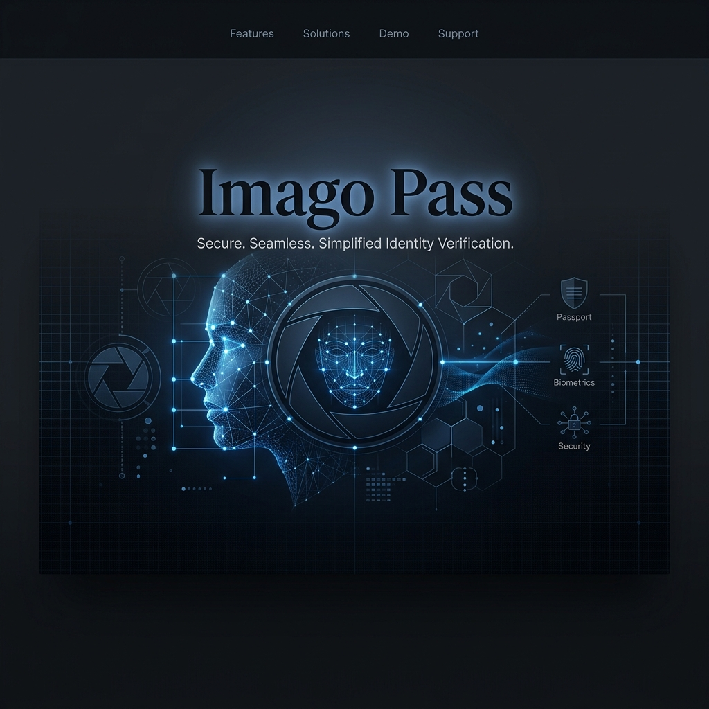

# Imago Pass — AI-Powered Biometric Studio



> **Professional-grade passport and ID photo creation, processed entirely in your browser.**

[](https://react.dev/)
[](https://vitejs.dev/)
[](https://tailwindcss.com/)
[](https://opensource.org/licenses/MIT)

---

**Imago Pass** is a high-end web application designed to simplify the creation of government-compliant passport and ID photos. By leveraging cutting-edge local AI, it ensures biometric precision while maintaining absolute user privacy.

## ✨ Key Features

- **🛡️ Privacy-First Background Removal**: Utilizing `@imgly/background-removal` via WebAssembly (WASM), your photos are processed **locally** in the browser. No image data ever leaves your device.
- **🗺️ Global Template Library**: Pre-configured dimensions for US, UK, EU, Australia, Canada, China, Japan, India, and more.
- **🖨️ Smart Print Layouts**: Generate single photos or print-ready strips (4x6", 8x10", or A4) with automatic photo tiling and alignment.
- **👁️ Biometric Alignment**: Adjustable eye-level guides ensure your head position meets strict ICAO 9303 standards.
- **🎨 Custom Studio Controls**: 
    - Flexible background colors (White, Blue, Grey, Red, etc.).
    - High-fidelity export options up to **1200 DPI**.
    - Intelligent JPEG quality adjustment to stay under portal file size limits (e.g., <200KB).

## 🚀 Getting Started

### Prerequisites
- Node.js (v18+)
- npm or yarn

### Installation
1. Clone the repository:
   ```bash
   git clone https://github.com/Sathvik-Nagesh/Imago-Pass.git
   cd Imago-Pass
   ```
2. Install dependencies:
   ```bash
   npm install
   ```
3. Launch development server:
   ```bash
   npm run dev
   ```

## 🛠️ Tech Stack

- **Core**: React 19, Vite 6, TypeScript
- **Styling**: Tailwind CSS 4, Motion (for fluid animations)
- **UI Components**: Custom-built using shadcn/ui primitives
- **AI/ML Engine**: `@imgly/background-removal` (Local WASM)
- **Image Processing**: `react-image-crop`, Canvas API
- **Icons**: Lucide React

## 🔮 Future Roadmap

We are constantly looking to improve Imago Pass. Here are some planned features and ideas for expansion:

- [ ] **AI Lighting Correction**: Automatically normalize shadows and highlights to prevent rejection due to uneven lighting.
- [ ] **Face Expression Validation**: Real-time detection of smiles or closed eyes (biometric non-compliance triggers).
- [ ] **Automatic Eye-Level Detection**: Auto-cropping based on face-mesh detection.
- [ ] **Multi-Person Batching**: Process and tile photos for entire families in one go.
- [ ] **PWA Support**: Full offline capability and direct installation on mobile/desktop.
- [ ] **Shadow Retention**: Intelligent background removal that retains natural shadows for a more realistic "studio" look.

## 🤝 Contributing

Contributions are welcome! Please feel free to submit a Pull Request.

---

*Built with ❤️ for a more secure and private digital identity experience.*
